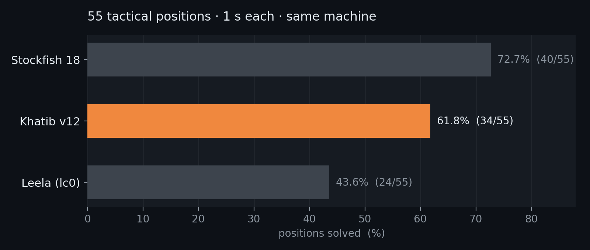
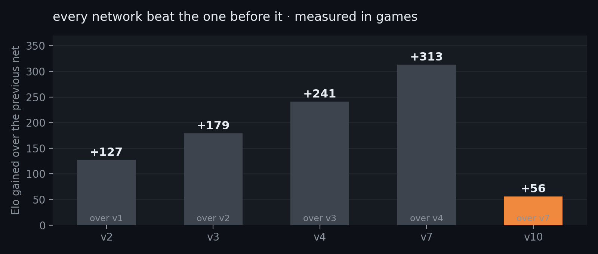

# Khatib

A chess engine in Rust with an NNUE neural-network evaluation. **~2544 Elo** —
strong club strength. Runs in any chess GUI, or as a bot on Lichess.

Named after its author, Nassim Khatib.



30 hard positions, one second each, every engine on the same machine. Run it
yourself with `python3 scripts/benchmark.py --all`.

## Install

Needs [Rust](https://rustup.rs). Builds in about a minute.

```bash
git clone https://github.com/Nesbesss/khatib-chess
cd khatib-chess
cargo build --release
```

The binary lands at `target/release/chess` and loads `net.nnue` from the repo
root automatically.

```bash
./target/release/chess          # UCI mode — what a GUI talks to
./target/release/chess serve    # search visualizer at localhost:8080
```

## Play against it

For engine development, use the [Fastchess testing setup](docs/testing.md):

```bash
python3 scripts/sprt.py NEW_BINARY OLD_BINARY --new-net NEW.nnue --old-net OLD.nnue
```

It supports different network architectures, colour-reversed opening pairs,
SPRT and resumable results. Search Elo measurements from the old `duel.py`
match loop are invalid because it reused the same opening.

Khatib speaks **UCI**, so any standard chess program can use it.

**On your computer** — install a free GUI ([Cute Chess], [Arena], or [BanksiaGUI]),
then add a new engine and point it at `target/release/chess`. That's the whole
setup; the GUI handles the rest.

**On Lichess** — Khatib can run as a real bot account you or anyone else can
challenge:

```bash
# 1. Make a fresh Lichess account (bot accounts must never have played a game)
# 2. Create a token at lichess.org/account/oauth/token/create with "bot:play"
LICHESS_TOKEN=<your-token> python3 scripts/lichess_bot.py --upgrade   # once
LICHESS_TOKEN=<your-token> python3 scripts/lichess_bot.py --seek 5+3  # play
```

`--seek 5+3` queues for 5+3 games so real players get matched with it from the
pool; without it the bot only waits to be challenged at
`lichess.org/@/<your-bot>`. Add `--rated` to earn a real public rating.

**On chess.com** — you can't. Chess.com has no engine-connection feature and
their terms prohibit engine assistance in games. Use Lichess, which supports
bots officially, or play a GUI locally.

[Cute Chess]: https://cutechess.com
[Arena]: http://www.playwitharena.de
[BanksiaGUI]: https://banksiagui.com

## How it compares

| Engine | Hard suite (1 s) | Notes |
|---|---|---|
| Stockfish 17 | 14/30 | the strongest engine there is |
| **Khatib** | **12/30** | this project |
| Leela (lc0) | 10/30 | neural-network engine, CPU here |

Khatib scores 11–12/30 across runs, so treat the gap to Stockfish as small but
real. Against Stockfish limited to 2600 Elo it takes **42%** over 50 games,
which puts it near 2544.

Stockfish is a far more mature engine and this does not claim to match it. The
interesting part is that a network trained on a modest budget lands in the same
neighbourhood.

## Still training

The engine is not finished. Current state:



Each network was kept only after beating the previous one in real games. The
next architecture (2048 wide with a second hidden layer) is written and
numerically verified, but untrained — it needs GPU time. Training data is
generated by self-play and labelled with Stockfish; the pipeline is in
`trainer/`.

## What's inside

| | |
|---|---|
| Move generation | magic bitboards, 33/33 perft positions exact |
| Search | alpha-beta, iterative deepening, TT, LMR, null-move, countermove history |
| Evaluation | NNUE — 768×8 buckets → 1536×2 → 8 output buckets, incrementally updated |
| Threading | Lazy SMP, depth 19 → 22 in 3 s from 1 to 8 threads |
| Also here | WebAssembly build, a macOS app, and a web visualizer of the search |

Every change above was accepted or rejected by playing hundreds of games, never
by node counts or intuition — both misled repeatedly. The full record, including
a measurement bug that hid two real improvements for days, is in
[docs/DEVELOPMENT.md](docs/DEVELOPMENT.md).

## License

MIT — see [LICENSE](LICENSE).
